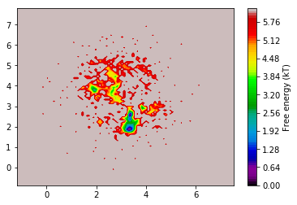
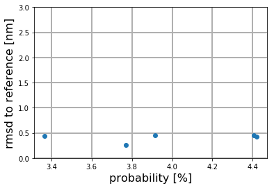
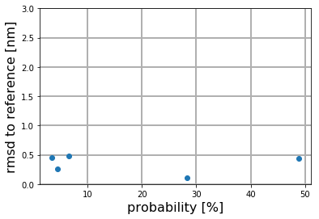
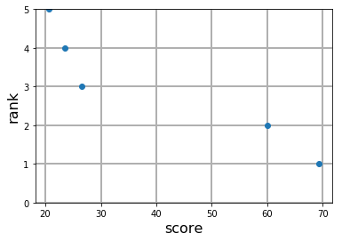

# Prediction of drug fragment binding poses using Molekular Dynamic simulation and Markov State Models (MSM)

In this notebook we will show how to use MSM_bind to predict the binding pose of a drug fragment. 
We will use the bromo domain, which recognizes acetylated lysine residues and is an important target for anti-cancer drugs. The Crystal structure of the bromodomain and the ligand 4'-Hydroxyacetophenone were obtained from the pdb (5cq8).
The structure of the fragment is shown in the first figure. 


This notebook has been tested for version 1.0. The MSM_bind package contains a workflow to easily set-up and adjust work flows to generate predictions for the drug fragment binding poses. The package is dependent on other common python packages. Make sure you have all of them installed for the program to work. The packages are:

* pyemma 2.3.2 with msmtools of the conda-forge channel
* numpy 
* pylab
* scipy
* os
* subprocess 
* random 
* sys
* pmx 

Also the program needs to use Gromacs. After installing all the packages we can proceed with the tutorial.

# Load the package and set global variables

Now we load the package and define that the images should be placed inside this notebook.


```python
##### import functions
import numpy as np
import MSM_bind

%load_ext autoreload
%autoreload 1
%aimport MSM_bind

%matplotlib inline
```

    /home/tb/stlinker/conda-envs/env_steph/lib/python2.7/site-packages/pyemma/__init__.py:91: UserWarning: You are not using the latest release of PyEMMA. Latest is 2.4, you have 2.3.2.
      .format(latest=latest, current=current), category=UserWarning)


The global variables define where our simulation data is stored (input_xtc1, input_pdb1) and where the output of the program is saved (out_data1). If you have an X-ray reference and want to compare it with the result, set compare to reference to True and define a path for reference1. 


```python
fragment='5cq8'
protein='bromo'
#folder wehere raw .xtc files are. Only write out the protein and fragment coordinates
input_xtc1=['/home/tb/stlinker/tutorial/example_trajs' ]
#path where to find the structure (protein and fragment)
input_pdb1='/home/tb/stlinker/tutorial/example_trajs/prot_mol.pdb'
# during the program multiple files will be generated and afterward deleted. They are saved in this folder
out_data1='/home/tb/stlinker/tutorial/out_data' 

# set to True if you want to compare the results to your X-ray reference 
compare_results=True
#reference path if you want to check to model quality
if compare_results:
    reference1='/home/tb/stlinker/tutorial/example_trajs/prot_mol.pdb'
```

Next you have to define the Gromacs version you are using. Lagtime and the number of clusters are important parameters for the Markov State Model. A lagtime of 50 ns and 600 clusters gave good results for most protein/fragment combinations. However, feel free to play around with these values.   


```python
gromacs_version1=5
lagtime1=20
n_clusters1=100
```

# Load the data

Then we have to load the trajectories. Therefore you have to define the folder, where the data is located (here input_xtc1). The program will load all .xtc files in this folder. So be careful that no incorrect trajectories lay around in this folder. 

There are also some additional restrictions on the simulations: The simulation time-step should be 1 ns. The fragment should be named 'MOL'. If you remove the water atoms and only use the protein and fragment coordinates (e.g. with trj_conv), the program will be much faster.


```python
#first load the unprocessed data (and align it to the structure)
load_data=MSM_bind.Load_process_data(input_xtc=input_xtc1, input_pdb=input_pdb1, sim_timestep=1)
traj_list= load_data.load_data()
structure= load_data.load_structure()

# test how many trajectories are loaded
print len(traj_list)
```

    40


# Cluster the data

In order to build the Markov State Model we have to cluster the data. Here we cluster based on structural similarity. You can define the clustering algorithm with the cluster_method option. Possible clustering methods are k_means and uniform_time. 

The coordinates option defines on which atoms the clustering is performed. Using the 'heteroatom' option, the clustering is performed on the heteroatoms of the ligand. Heteroatoms are often involved in specific binding to the protein. Additionally each fragment only contains a few heteroatoms. Therefore, we have a reduced dimensionality but capture the most important interactions.  
Other possibilities are 'contacts' (shortest distance between the ligand and protein atoms). A third option 'prot_frag' is planned, which includes the heteroatom atoms as well as the nearest protein residues.  


```python
#Then cluster the data
clustering_class=MSM_bind.Cluster_data(traj_list, input_pdb=input_pdb1, lagtime=lagtime1, cluster_method='uniform_time', n_clusters=n_clusters1, coordinates='heteroatom', visual=True)
clustering_class.get_coordinates()
clustering_dict=clustering_class.clustering()





# Sort the data

Here we remove small clusters and add their content to neighbouring clusters. This ensures that the Markov State Model is well connected. Also all clusters that are further from the protein then 0.5 nm, are lumped into one unbound cluster. If you want, you can skip this step.  


```python
#Remove small cluster and sort into bound and unbound cluster 
sorted_clusters=MSM_bind.sort_cluster(clustering_class)
sorted_clusters.remove_small_clusters()
lesscluster=sorted_clusters.assign_bound_unbound()
```


# Build a Markov state model

Here we now build the Markov State Model. For further details look at the PyEMMA package. If you want to compare you results to the reference, you can use the testing class. 


```python
#build a simple MSM model
m=MSM_bind.simple_MSM(clustering_class, lesscluster, out_data=out_data1, lagtime=lagtime1)
m.create_MSM()
m.get_highest_populated()

# compare rmsd to the reference
if compare_results:
    Testing_mod=MSM_bind.Test_the_model(reference1, m.structure_list )
    Testing_mod.compare_to_reference( out_data=out_data1, reference=reference1)
    Testing_mod.rmsd_plot(m, 'prob')
```





The highest ranked structures are saved in the output folder. The centroid of the cluster is called "simple_MSM_centroid_rank_1.pdb". The whole cluster is saved as "simple_msm_most_rank_1.xtc". You can have a look at them using e.g. pymol. It should look similar to: 


A very quick way for a quality control of the model is to check the survival probability of the highest ranked states. The survival probability is the chance that the fragment stays in the same cluster after one lag time. This is equivalent to the diagonal element of the transition matrix. The closer to 1, the more stable is the state. We expect the correct binding state to be very stable. 

However, if n_cluster is large the binding state is disrupted into multiple states, which reduces the survival probability. Disrupted states can be detected and but together by kinetic clustering (see below). 


```python
# diagonal elemnt of the cluster
highest_clusterlist= np.argsort(m.mm_distr)[::-1][:5]
rank=1
for i in highest_clusterlist:
    print "Rank %i structure has a survival probability of %.3f" % (rank, m.distr.transition_matrix[i][i])
    rank=rank+1
```

    Rank 1 structure has a survival probability of 0.188
    Rank 2 structure has a survival probability of 0.159
    Rank 3 structure has a survival probability of 0.171
    Rank 4 structure has a survival probability of 0.871
    Rank 5 structure has a survival probability of 0.136


# Residence time analysis

By building the Markov State Model with high lagtimes, we reject some information of the trajectories. One of the most important information is the residence time. Good ligands stay for a long time in the binding pocket. Their residence time usually exceeds the simulation time. Therefore, we check how long the fragment actually stays in its proposed bound state. 

In order to do so, we use structural similarities, because they are independent of cluster disruption. The residence time analysis tool detect binding and unbinding events, as well as the total binding time. A bonus is granted for binding events (weighted by the binding time) and a malus for unbinding events. Afterwards, the relative score of the top 5 structures is determined and added to the relative score from the Markov state model. 


```python
#get the quality control ranking
list_of_representatives=m.structure_list

quality_scoring=MSM_bind.Scoring(list_of_representatives, traj_list=traj_list, out_data=out_data1)
quality_scoring.quality_score()
#print the relative residence tiem score of the top 5 clusters
print "relative residence time score"
print quality_scoring.rank_quality_control
#print the relative MSM score of the top 5 clusters
print "relative MSM score"
print m.prob[:5]/sum(m.prob[:5])
#print the total score of the top 5 clusters
print "total score"
total_score=quality_scoring.rank_quality_control+m.prob[:5]/sum(m.prob[:5])
print total_score
```

    relative residence time score
    [ 16.95181526  19.63766778  19.52700905  25.23018955  18.65331835]
    relative MSM score
    [ 0.22230423  0.22161172  0.1970435   0.18961092  0.16942963]
    total score
    [ 17.17411949  19.8592795   19.72405255  25.41980048  18.82274798]


# Kinetic clustering

As discussed above a large number of clusters can lead to the disruption of states into multiple sub-states. Therefore the score of one individual sub-state might be small, but the sum of all connected sub-states might be large. Therefore we perform kinetic clustering on the states to put the connected states back together. We define connected states as states which interchange quickly and are structurally related. 

Two different methods to do the kinetic clustering are implemented in MSM_bind. The maxtrace algorithm aims to maximize the diagonal values of the transition matrix. Those values are equivalent to the survival probability. The PCCA method is based on the PCCA+ spectral clustering method, which detects the fastest kinetics among subsets. 

The variable nstates_cg defines how many coarse grained states we aim for. 


```python
#initiallize kinetic clustering
kinetic_lumping=MSM_bind.Kinetic_clustering(m, out_data=out_data1, PCCA_exclusion_value=0.0, nstates_cg=10)

# choose on of the methods below
#for maxtrace method
#kinetic_lumping.maxtrace_states()

#for PCCA method
kinetic_lumping.PCCA_states()
```

In addition we apply a structural restrain on the sub-states. Subsequently, the clusters are lumped together to form bigger coarse grained clusters.   


```python
#select the states that are found in the highest ranked states and are small
kinetic_lumping.lump_cluster_max_small()
print kinetic_lumping.lumpstates
#use an additional restraint on the structure similarity
kinetic_lumping.similarity_restraint()
print kinetic_lumping.lumpstates
#lump the states together to get a new trajectory
kinetic_dtraj=kinetic_lumping.lump_states()
```

    [[14, 15, 27, 28, 39, 40, 41, 46], [2, 3, 4, 10, 11, 12, 16, 17, 24, 25, 26, 34, 35, 47, 48, 52, 53, 57, 58, 61, 66, 67, 71, 72, 75, 79, 81, 82, 88, 89, 94, 97, 98], [0, 1, 18, 19, 20, 37, 38, 51, 54, 55, 56, 59, 73, 74, 76, 77, 86, 87]]
    [[27, 39, 41], [14, 15, 28, 40, 46], [2, 3, 4, 10, 11, 12, 16, 17, 24, 25, 26, 34, 35, 47, 53, 58, 66, 67, 71, 72, 79, 81, 82, 88, 89, 94, 97, 98], [0, 1, 18, 19, 20, 37, 38, 51, 54, 55, 56, 59, 73, 74, 76, 77, 86, 87]]


# Build a new MSM based on the lumped clusters

We can now build a new Markov state model on the kinetically clustered states.


```python
# build a new MSM based on the clustered trajectory
m_kin=MSM_bind.simple_MSM(clustering_class, kinetic_dtraj, out_data=out_data1, lagtime=40)
m_kin.create_MSM()
m_kin.get_highest_populated()

# test with rmsd
if compare_results:
    Testing_mod_kin=MSM_bind.Test_the_model(reference1, m_kin.structure_list )
    Testing_mod_kin.compare_to_reference(out_data=out_data1, reference=reference1)
    Testing_mod_kin.rmsd_plot(m_kin, 'prob')
```





Additionaly, we can test if the survival probability of the states has incereased


```python
# diagonal elemnt of the cluster
highest_clusterlist= np.argsort(m_kin.mm_distr)[::-1][:5]

rank=1
for i in highest_clusterlist:
    print "Rank %i structure has a survival probability of %.3f" % (rank, m_kin.distr.transition_matrix[i][i])
    rank=rank+1
    

```

    Rank 1 structure has a survival probability of 0.957
    Rank 2 structure has a survival probability of 0.901
    Rank 3 structure has a survival probability of 0.632
    Rank 4 structure has a survival probability of 0.889
    Rank 5 structure has a survival probability of 0.355


# New residence time analysis

And performe a new residence time analysis on the lumped states.


```python
#get the quality control ranking of kinetic clustered
list_of_representatives_kin=m_kin.structure_list

quality_scoring_kin=MSM_bind.Scoring(list_of_representatives_kin, out_data=out_data1, traj_list=traj_list,)
quality_scoring_kin.quality_score()
print "relative residence time score"
print quality_scoring_kin.rank_quality_control
```

    relative residence time score
    [ 16.06644796  29.10406904  16.32763363  21.72168073  16.78016864]


# Plot scoring

Here we plot the total score and the rank. The highest ranked structures are saved in the output folder as "scoring_rank1.pdb". Additionally the flexibility of the ligand in the binding pose is tested and saved as a B-factor. A low B-factor is equivalent to a strong bound part. Therefore this can help designing better ligands by keeping strongly bound parts and replacing flexible, unbound parts of the fragment. 


```python
# plot the scoring and get the B_factor
out_sec=MSM_bind.output_section(  out_data=out_data1, input_pdb=input_pdb1,)
#always call the B_factor function first
out_sec.B_factor(quality_scoring_kin)
#after this call the plotting function
out_sec.plot_ranking(quality_scoring_kin.rank_quality_control,m_kin)
```





B-factor representation:


